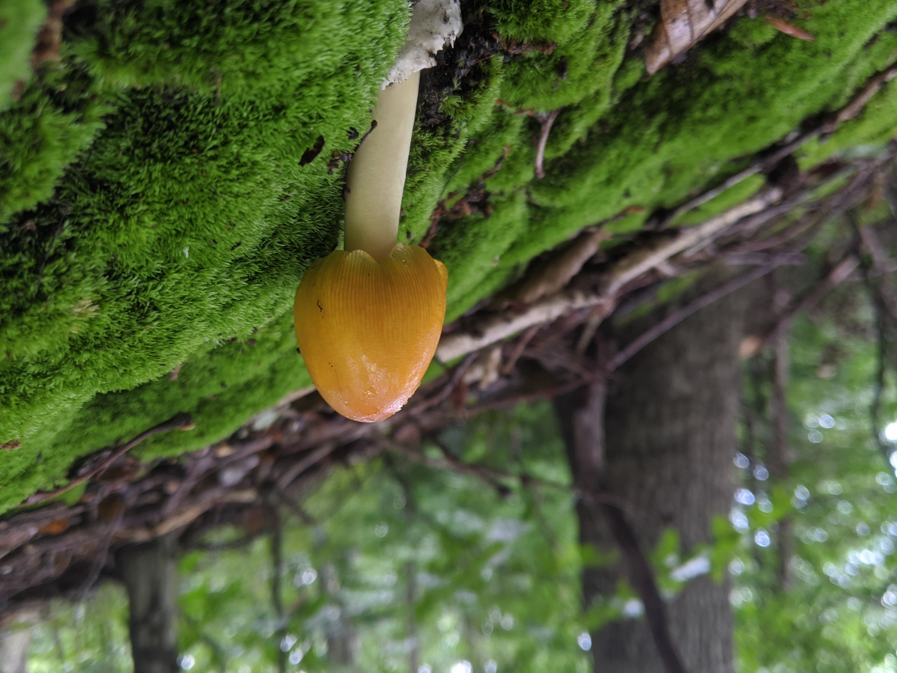

  

For me, technology is both my greatest ally and my worst enemy. Distractions are all around me in many different forms. There has been more than one day where I saw no sun at all. However, those days were not without days where technology enhanced the things around me either.  

In 2016, Pokemon Go came out. Those first few weeks of going to the park, seeing everyone staring at their phones and knowing exactly what they were doing were quite magical times.  

Now, my main focus in software is to help achieve symbiosis.  

As a long distance runner, having the right gear and setup makes all the difference. Advances in bluetooth technology finally gave me a chance to lose the cords, and the hassle, for good.  

When you're out running, there's a lot of time to think. While I love thinking, sometimes I want to take notes. It can be somewhat tough to stop running. I dream of a day that I can simply start talking and have notes picked up and transcribed for me (hopefully soon!).  

In a similar vein, I enjoy mycology. While some mushrooms are easy to identify...  

  

This morel mushroom is very easy to identify and tasty to boot!  

Some mushrooms are much harder to identify.  

  

While applications exist to assist in identification, none that I have seen really get the job done. There's an entire class of mushrooms known as little brown mushrooms that tend to cause the most intoxications in humans. These mushrooms are extremely hard to identify for sure. I hope one day to assist in mushroom identification software and perhaps even predicting where they're fruiting!  

In short, my goals as a software developer are to assist people in getting outside without stressing their necks.

Side note: the pictures seen here have all been taken with my smartphone and "digitally enhanced" via machine learning.  

