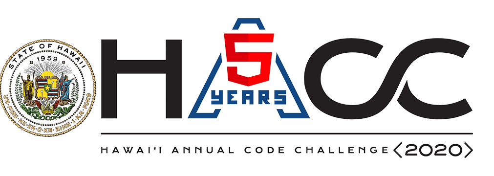

  

The Hawaii Annual Code Challenge (HACC) is a contest held by the state of Hawaii in order to design an application to their specifications. This year there were a few different potential applications to develop and around 100 people (20ish teams) competed for the grand prize of $4000. Due to Covid-19 this year the contest was entirely online, however, in the past the closing day of the HACC took place in person.  

The contest took place in a little over a month. The application specifications were released before the actual start date of the contest so truly enterprising teams could have gotten a head start on their app. About a week before the final day of the contest was a 'technial review' of our apps in order to narrow down the field. This day could be seen as the true end of the HACC, as we had more time to show what our app could do during this period than the actual presentation.  

For further information, see the contest webpage [here](https://hacc.hawaii.gov/).  

The HACC was an exceptional challenge to me personally. Because this was my first semester at UH Manoa, I had no familiarity with my classmates (and teams were required). On top of this, the team that finally accepted me decided on a language I had little working experience with (Javascript) and used React Native for the app (which I had no experience with). That said, my teammates were great and I wouldn't hesistate to work with any of them again.  

Our entry was for the First Lady Dawn Amano-Ige in order to make an application that gave a home for all of the splintered resources for people in Hawaii. A description of the specifications can be found [here](https://hacc.hawaii.gov/wp-content/uploads/2020/10/Challenge_2020_ResourceDirectory.pdf).  

We made an Android application for our project but because we used React Native, the application would theoretically run on an Iphone device and could be easily modified to do so. Unfortunately none of us had a Mac or Iphone so we were unable to test that capability. Besides this, the app could also be easily ported to a React app to be used on the web. While we made these types of considerations and others (such as localizations), we decided that a quick and dirty solution was best.  

                
        

Our team was HACCsgiving and our project page can be found [here](https://devpost.com/software/helping-hands-o96srp) with a Github repo [here](https://github.com/HACC2020/HACCsgiving). As previously mentioned, our front-end was React Native and we used Firebase to provide a BaaS in order to keep the ease of use in case First Lady Dawn actually wanted to use our project. We made a relatively simple but effective app that provided a place to see many of Hawaii's government services as well as a link to more infomation for each one. We also provided a searchbar to quickly narrow down services to fit needs and a couple of quick-links for searches we felt were important. Besides that, the app also has login functionality. This was necessary in order to hide another stats type page that shows additional information based on how the app is used.  

Our team was managed entirely over Discord. We started out with around three people but managed to get five in the end. My teammates were [Graham Francisco](https://github.com/gbfrancisco), [Calvin Liang](https://github.com/calvan-liang), [Michah Kim](https://github.com/kimmicah) and [Chris Na](https://github.com/chrisjna). Their Github pages are attached to their names.  After the start of the HACC, we talked over voice chat and decided on specifications and created a couple of focus areas for people to work on. Because I already had some thoughts about implementation, I went ahead and made a mockup for our app. This mockup served as a great launchpad for our project, and really helped to give the team an idea of what to do.  

Although we did not use any formal methodology (Agile, Scrum, etc), we were all pretty familiar with that and ended up adopting a simliar workflow anyway. We tended to work in sprints together, meeting up on important days. No one was assigned any roles but we ended up taking roles anyway. I worked in a number of areas on the app. I did the lion's share of the work with Firebase and linking it to our code. Besides that, because of my work with the mockup I quickly became responsible for the direction we headed (whether I wanted it or not). I felt entirely out of place taking that role, as I had little experience with React Native. However, my experience developing phone apps was probably the highest in the team, so there were plenty of ways for me to make myself useful.  

                
        

Our biggest failing as a team was probably in a lack of a clear goal. If I remember correctly, early on someone asked whether we wanted to win or not, to which a serious reply was not given. Because we did not enunciate that point, I had times where I questioned how much work I should put in. Even if we did not want to win, I feel making that clear could have helped our team, even if that meant the app might have become worse from it. Overall, the biggest point of learning for me was more about these types of contests as a whole. The normal app development process truly needs to be kicked to the curb when attending a hackathon. I was able to verify that the person doing our technical review did not test the app. Some things I feel are very important (like user flow), are things that the HACC had no acknowlegement for, and spending any time on that is wasted.  

                
        

Overall, while I would not attend the HACC again, I felt the gains outweighed the expenses. My programming skillset at times can feel useless when faced with problems liked hunger and homelessness. The opportunity to create something that could almost certainly only result in a net gain for those in need is an opportunity I would be most willing to take again.  

Source: <a href="https://github.com/HACC2020/HACCsgiving"><i class="large github icon"></i>HACC2020/HACCsgiving</a>

