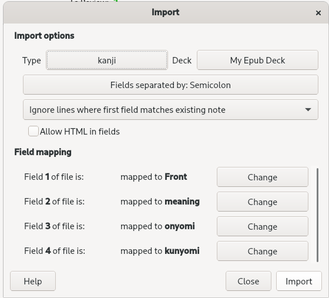

The Kanji frequency tool is a small application I wrote around the middle of 2020, in Rust.  

The intention of this tool is to import the .txt file outputted from the program into an [Anki](https://apps.ankiweb.net/) deck (an SRS flash card learning system) in order to complement learning while reading Japanese books.  

## How it works  

The app itself does not do all that much. It parses the epub given as a command line argument then strips everything inside of it except the kanji. Then a list is created, holding all of the kanji found and increases the frequency each time a redundant kanji is found. The resulting list is then ordered from most frequent to least. After that, the application parses the [kanjidic](https://www.edrdg.org/wiki/index.php/KANJIDIC_Project) dictionary and makes another list.  

The two lists are then merged, with a new data structure for only the kanji in the book. Finally, the resulting list is printed to a (partially) human readable text file. Any kanji that were not found will be printed to the console. Here is an example of that:  

```
These kanjis were not found in the dictionary:
('々', 111)
('〇', 21)
```  

Note: ('々', 111), the kanji is on the left and the frequency is on the right. The kanji, '々', is the repeater kanji that simply doubles the kanji that came before it. Not sure why kanjidic did not want to include that. Similarly, '〇', serves a similar role as an algebraic `x` might. Typically you see it when someone might say, "he works for so-and-so company" or something to that effect.  

## Try it yourself  

Upon retrieving the resulting txt file, it can be imported into Anki with File->import...->your_output.txt  

The resultant import will have to use a custom card type in order to incorporate all of the fields.  



New cards are shown by frequency, so learning will take place with the most important kanji first. Ideally, This tool should be used in tandem with reading native materials. Although Anki starts everyone with 20 new cards a day, I find that to be somewhat dreary so I personally set mine to 10 a day.  

Field 1 (front) is the kanji, 2 is meaning, 3 is on'yomi (represented in katakana), and field 4 is kun'yomi in hiragana.  

example: `cargo run example.epub output.txt`  

In my testing, some books could take over a minute.  

## Future Improvements  

The current method of importing to Anki is somewhat difficult. The next improvement would be to create an anki file type rather than a txt file so that it can be easily transferred to mobile devices. Besides that, my real goal with this app is to incorporate some amount of natural language processing.  

Ideally, the app would return a certain amount of kanji, mixed in with a word frequency tool as well.  
 
Source: <a href="https://github.com/keggit/epub-kanji-frequency/"><i class="large github icon"></i>keggit/epub-kanji-frequency</a>