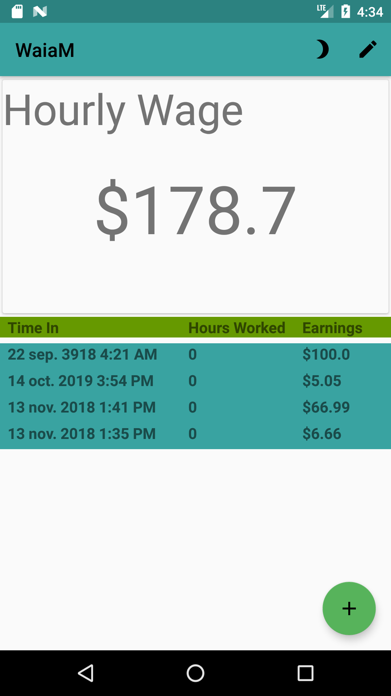

  

What am I actually making? is an android application written in Java using native android develpment tools. The purpose of the application is to assist those among us who do not make a consistent wage better understand how much they are earning.  

Some feature include: dark and light mode, custom pickers and nice statistics.  

This was one of the first (larger scale) applications I wrote and despite the crude interface I am quite proud of my achievement. This application was also the first time I used a development methodology. I used a kanban system where I wrote features and milestones on sticky notes and moved them to other parts of the board as they were implemented.  

While this application does not appear to have any material design, when I wrote it, some of the techniques I used were accepted material design things. Such as, the action button at the bottom of the app, the icons at the top right and so on. A potential change for this application could be changing the color scheme. While I do not wholly dislike the teal/olive green combo, the typesetting appears very ugly because of that. To add to that, the app doesn't really pop. Adding elements such as elevation could give each of the different portions of the layout a nice feel. Finally, seeing 'WaiaM' the entire time the app is open is somewhat redundant. In order to fix that, I would have the AppBar color match the background so it would look like part of the background and then my icons use the accentColor so they pop out a bit more.  
S
In this project I learned a lot about how native development works for android. Since then I've moved into other development frameworks (flutter, react) however the I feel I have an edge on other developers who only use 3rd party frameworks because they do not neccessarily know how the apps run.  

Source: <a href="https://github.com/keggit/WaiaM"><i class="large github icon "></i>keggit/WaiaM</a>

