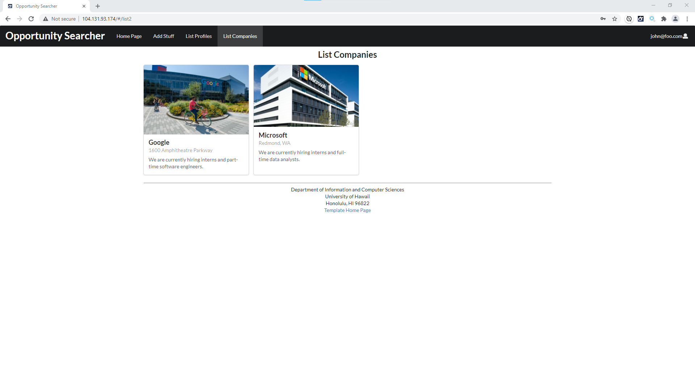

  

## Overview

[Matthew Ito](https://github.com/Matt-Ito), [Jay Paul Luben](https://github.com/jpluben) and I worked together to create this React web application. On Opportunity Searcher, students or companies can sign up for the service and create their profile. Once created, they can search through other companies or students to find ones that fulfil their needs. The application is available at [opportunity-searcher.xyz](https://opportunity-searcher.xyz)

## Design Decisions  

We followed an issue driven approach to writing this application. We used the kanban feature on Github, and created issues to match the things that needed to be done. Using this approach allowed us to divide work evenly as well as ensure that no one was working on same thing as the same time. Because there were only three of us, I played a large role in the project. I helped to create the mockup application using html so it was more easy to translate that to a working application. Additionally, while we each took turns in leadership, I managed our kanban and sort of acted as a 'scrum master' of sorts. Not only that, I also developed the api for our database as well as a few of our pages and all of the testing. 

  

## Overall  

This project was probably one of the smoothest team projects I have worked on. Our development flow was very neat and led to a good understanding of where we were. Although there are better versions of the same project out there, I think our project is still valuable because of the simplicity. It is possible to find more details about the project on our [github.io page](https://opportunity-searcher.github.io)

Source: <a href="https://github.com/opportunity-searcher/opportunity-searcher"><i class="large github icon "></i>opportunity-searcher/opportunity-searcher</a>

